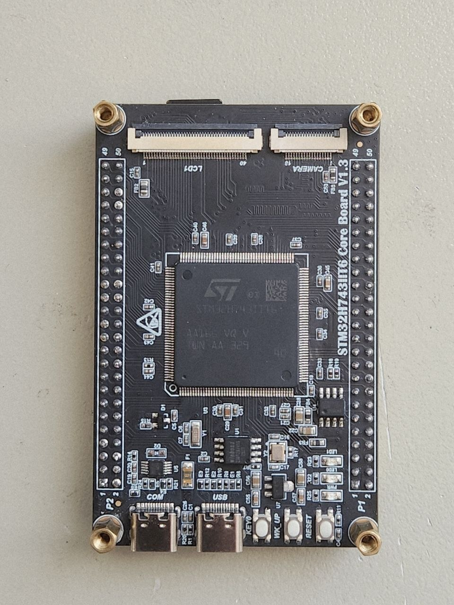
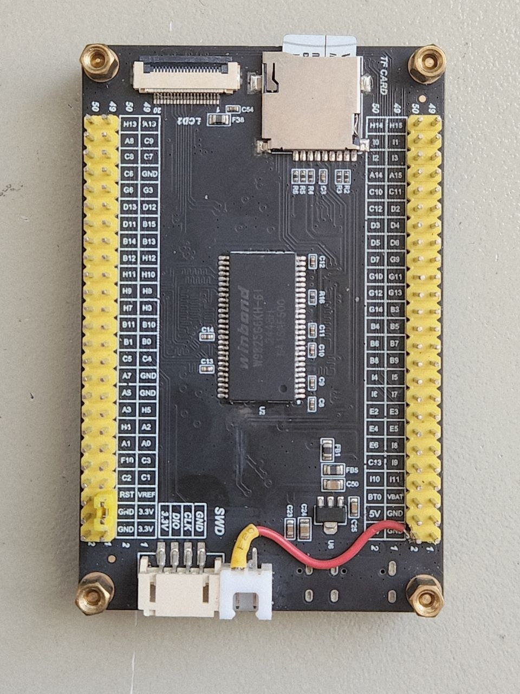

# STM32H743IIT6 Core Board V1.3

Community documentation for the STM32H743IIT6 Core Board V1.3, produced by a Chinese manufacturer.

> **Note:** The original schematics are not included in this repository as we have not yet received permission from the
> manufacturer to share them.
> **Note:** We are not fully sure about the exact manufacturer company name yet.

---

## Overview

| Item           | Details                             |
|----------------|-------------------------------------|
| MCU            | STM32H743IIT6 (LQFP176)             |
| Core           | ARM Cortex-M7 @ up to 480 MHz       |
| Flash          | 2 MB internal + 16 MB external QSPI |
| RAM            | 1 MB internal + 32MB external SDRAM |
| Board revision | V1.3                                |
| Schematic date | Unknown                             |

---

## Board Pictures

### Top View

> **Note:** One diode is missing on this top-side photo.

### Bottom View

> **Note:** This bottom-side photo shows a user-applied mod.

---

## Quick Links

- [Pin Assignments](docs/pinout.md)
- [Peripheral Details](docs/peripherals.md)

---

## Contributing

If you have additional details about this board (measured pin functions, tested peripheral configs, confirmed part
numbers), please open an issue or PR.